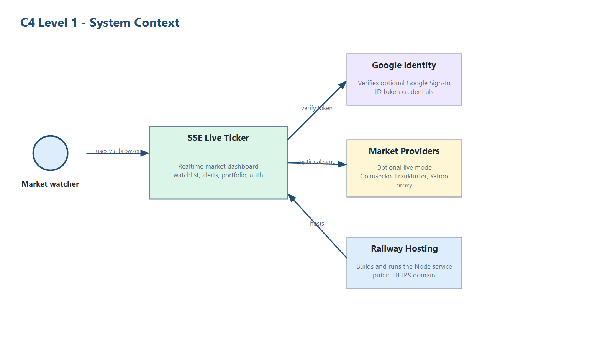
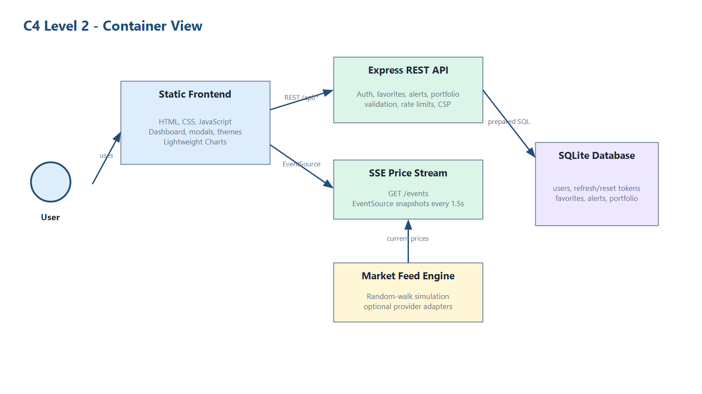
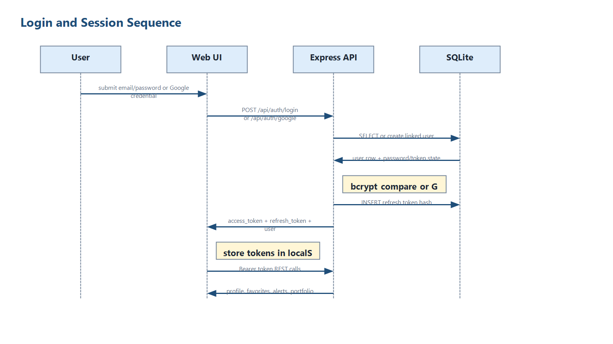
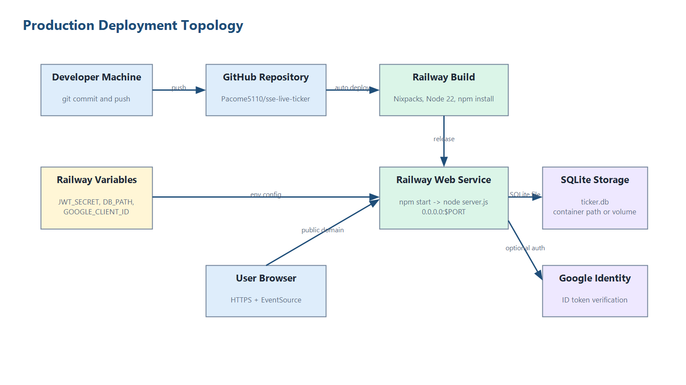
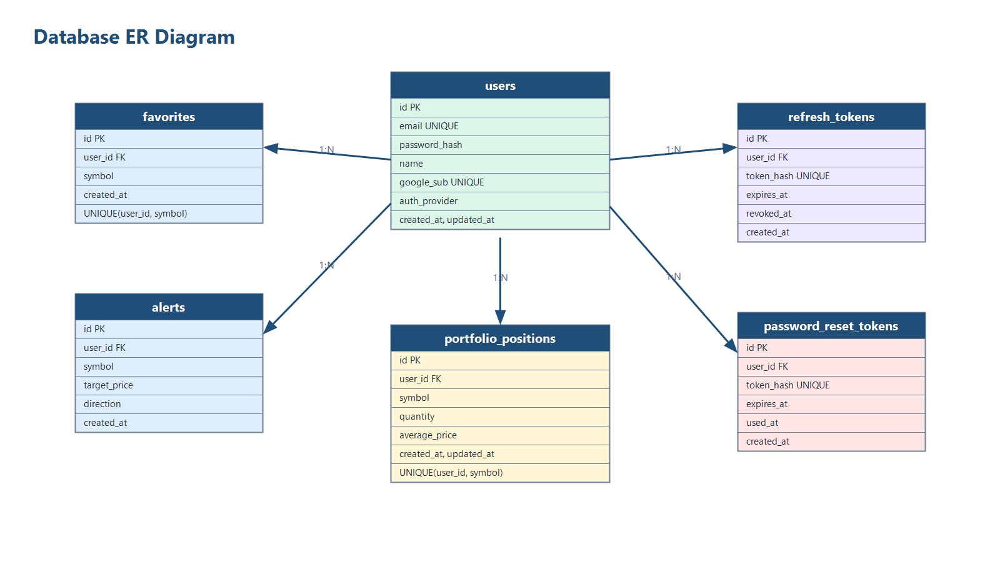

# SSE Canlı Borsa Ticker

> **Proje Kodu:** P12 · **Ders:** BMU1208 Web Tabanlı Programlama · **Dönem:** 2025-2026 Bahar

**Öğrenci:** PACOME BERINYUY FONDZENYUY  
**Öğrenci No:** 24080410151  
**E-posta:** pacomealex2@gmail.com  
**Kurum:** Bitlis Eren Üniversitesi, Mühendislik-Mimarlık Fakültesi, Bilgisayar Mühendisliği  
**Ders Yürütücüsü:** Dr. Öğr. Üyesi Davut ARI  
**Son Güncelleme:** 23.05.2026  
**Durum:** Geliştirme ve Railway deploy tamamlandı  
**Canlı URL:** https://sse-live-ticker-production.up.railway.app

---

## İçindekiler

1. Proje Künyesi
2. Yönetici Özeti
3. Problem ve Motivasyon
4. Hedef Kitle ve Persona
5. Ürün Gereksinimleri
6. Piyasa ve Rekabet Analizi
7. Teknoloji Yığını
8. Sistem Mimarisi
9. Veri Modeli ve API Tasarımı
10. UI/UX Tasarımı
11. Güvenlik, Performans ve Test
12. Maliyet, Gelir Modeli ve GTM
13. Sonuç ve Gelecek Çalışmalar
14. Kaynakça ve Ekler

---

## 1. Proje Künyesi

| Alan | Değer |
| --- | --- |
| Proje adı | SSE Canlı Borsa Ticker |
| Slogan | WebSocket karmaşıklığı olmadan canlı piyasa takibi |
| Kategori | Finans, gerçek zamanlı dashboard |
| Platform | Responsive web |
| Backend | Node.js, Express, Server-Sent Events |
| Frontend | HTML, CSS, vanilla JavaScript, EventSource API |
| Grafik | Lightweight Charts |
| Veritabanı | SQLite, better-sqlite3 |
| Auth | bcrypt, JWT access token, rotating refresh token, Google Sign-In, password reset |
| Test | Vitest, Supertest, statik accessibility check, Lighthouse |
| API dokümantasyonu | `openapi.yaml` |
| Demo kullanıcı | Uygulama üzerinden yeni kullanıcı kaydı yapılabilir |
| Lisans | MIT |

---

## 2. Yönetici Özeti

SSE Canlı Borsa Ticker; hisse senedi, BIST sembolleri, kripto para ve döviz paritelerini tek ekranda izlemek isteyen bireysel yatırımcılar için hazırlanmış gerçek zamanlı bir web dashboard uygulamasıdır. Kullanıcılar piyasayı tablo halinde takip edebilir, sembol arayabilir, kategoriye göre filtreleyebilir, favori listesi oluşturabilir, fiyat alarmı kurabilir ve seçili varlık için grafik modalını açabilir.

Proje, gerçek zamanlı veri akışı için native Server-Sent Events yaklaşımını kullanır. Bu tercih, fiyatların sunucudan tarayıcıya tek yönlü aktığı finans ticker senaryosu için WebSocket'e göre daha sade bir mimari sağlar. Backend tarafında Node.js ve Express, frontend tarafında vanilla JavaScript, kalıcı veri için SQLite kullanılmıştır. Varsayılan demo modunda fiyatlar güvenilir sunum için random-walk simülasyonu ile üretilir; isteğe bağlı canlı sağlayıcı modu CoinGecko, Frankfurter ve Yahoo quote endpoint'lerini dener.

Ortaya çıkan MVP; kimlik doğrulama, Google giriş entegrasyonu, parola sıfırlama akışı, watchlist, portföy, fiyat alarmı, SSE stream, REST API, OpenAPI dokümantasyonu, test paketi, güvenlik başlıkları, rate limit ve Railway deploy çıktısı içerir. `npm test` ile 10 otomatik API testi geçmektedir. Lighthouse sonuçları: Performance 70, Accessibility 90, Best Practices 88, SEO 100. Canlı uygulama `https://sse-live-ticker-production.up.railway.app` adresinde, health check ise `/api/health` endpoint'i üzerinden doğrulanmıştır.

---

## 3. Problem ve Motivasyon

### 3.1 Problem

Bireysel yatırımcılar genellikle hisse, kripto ve döviz verilerini ayrı uygulamalardan takip eder. Bu durum özellikle mobil ekranda hızlı karar vermeyi zorlaştırır. Kullanıcı aynı anda hem fiyat değişimini hem yüzdesel hareketi hem favori sembollerini hem de alarm durumunu görmek ister. Mevcut büyük platformlar güçlü olsa da çoğu zaman fazla karmaşık, reklam yoğun veya yeni başlayan kullanıcılar için gereğinden ağırdır.

### 3.2 Çözüm

Bu proje, tek sayfalık ve hızlı açılan bir canlı ticker paneli sunar. Kullanıcı uygulamayı açtığında tablo anında dolar; SSE bağlantısı açık kaldığı sürece fiyatlar güncellenir. Kişisel özellikler için kayıt/giriş yapılır ve watchlist, portfolio, alert, refresh token ve reset token verileri SQLite üzerinde saklanır.

### 3.3 Farklılaşma

1. WebSocket kurulumu olmadan native `EventSource` ile gerçek zamanlı veri.
2. Kurulum kolaylığı: harici servis gerekmeden lokal SQLite ile çalışır.
3. Tek ekranda stock, BIST, crypto ve forex ayrımı.
4. Demo güvenilirliği: internet/API anahtarı yoksa simülasyon devam eder.
5. Raporlanabilir proje paketi: OpenAPI, ADR, diyagram, test ve QA çıktıları repo içinde.

### 3.4 Kapsam Dışı

V1 kapsamında gerçek al-sat işlemi, broker entegrasyonu, push notification servis worker, canlı BIST lisanslı veri ve gelişmiş teknik analiz sinyalleri yoktur. Portföy modülü pozisyon maliyeti ve anlık kâr/zarar özeti verir; broker hesabına bağlanmaz.

---

## 4. Hedef Kitle ve Persona

### 4.1 Birincil Segment

18-35 yaş arası, mobil ve web uygulamalarını aktif kullanan, kripto/döviz/hisse fiyatlarını hızlı takip etmek isteyen bireysel yatırımcılar.

### 4.2 İkincil Segment

BIST ve global piyasa sembollerini ders, analiz veya demo amacıyla takip eden bilgisayar mühendisliği öğrencileri ve yeni başlayan finans kullanıcıları.

### 4.3 Persona 1: Dijital Zehra

| Alan | Değer |
| --- | --- |
| Yaş / şehir | 24 / İstanbul |
| Rol | Üniversite öğrencisi, yeni yatırımcı |
| Teknoloji kullanımı | Mobil öncelikli, web dashboard kullanıyor |
| Ana hedef | Kripto ve döviz hareketlerini hızlı görmek |
| Pain points | Çok uygulama arasında geçiş, reklam kalabalığı, alarm kurmanın zor olması |
| Ürünü ne zaman açar? | Ders arasında veya piyasa hareketliyken |
| Motto | Hızlı bakayım, gerekirse sonra detayına inerim |

### 4.4 Persona 2: Analist Mehmet

| Alan | Değer |
| --- | --- |
| Yaş / şehir | 31 / Ankara |
| Rol | Finans meraklısı yazılım geliştirici |
| Teknoloji kullanımı | Desktop web, klavye ve geniş ekran |
| Ana hedef | Farklı piyasa türlerini tek tabloda kıyaslamak |
| Pain points | Veri kaynaklarının dağınık olması, küçük fiyat hareketlerini kaçırmak, kişisel listeyi senkron tutmak |
| Ürünü ne zaman açar? | Sabah piyasa açılışında ve gün içinde alarm kontrolünde |
| Motto | Basit ama gerçek zamanlı olsun |

### 4.5 JTBD

1. When I'm checking markets quickly, I want one live dashboard, so I can avoid switching between many apps.
2. When I'm following selected assets, I want a watchlist, so I can focus only on symbols I care about.
3. When a price reaches my threshold, I want a browser alert, so I can react without staring at the screen.

---

## 5. Ürün Gereksinimleri

### 5.1 North Star Metric

**North Star Metric:** Günlük başarılı canlı ticker oturumu sayısı. Bir oturum; sayfanın açılması, SSE bağlantısının kurulması ve en az bir fiyat güncellemesinin alınmasıdır.

### 5.2 MVP Kapsamı

| Özellik | Durum | Kanıt |
| --- | --- | --- |
| SSE canlı fiyat akışı | Tamamlandı | `GET /events` |
| Piyasa listesi | Tamamlandı | `GET /api/stocks` |
| Sembol detayı | Tamamlandı | `GET /api/stocks/{symbol}` |
| Login/register | Tamamlandı | `/api/auth/register`, `/api/auth/login` |
| Refresh token | Tamamlandı | `/api/auth/refresh` |
| Google login | Tamamlandı | `/api/auth/google`, `GOOGLE_CLIENT_ID` ile aktif |
| Password reset | Tamamlandı | `/api/auth/forgot-password`, `/api/auth/reset-password` |
| Watchlist | Tamamlandı | `/api/favorites` |
| Portfolio | Tamamlandı | `/api/portfolio` |
| Fiyat alarmı | Tamamlandı | `/api/alerts` |
| Grafik modalı | Tamamlandı | Lightweight Charts |
| Mobil görünüm | Tamamlandı | `docs/screenshots/06-mobile.png` |
| OpenAPI | Tamamlandı | `openapi.yaml` |

### 5.3 User Stories

| ID | Hikaye | Acceptance Criteria | Öncelik |
| --- | --- | --- | --- |
| FR-01 | Kullanıcı canlı piyasa tablosunu görmek ister. | Sayfa açılınca tablo dolar ve fiyatlar SSE ile güncellenir. | Must |
| FR-02 | Kullanıcı sembol aramak ister. | Arama kutusu sembol, şirket adı ve sektöre göre filtreler. | Must |
| FR-03 | Kullanıcı kategori seçmek ister. | Stock, BIST, Crypto, Forex sekmeleri doğru filtreler. | Must |
| FR-04 | Kullanıcı fiyat/yüzde/hacme göre sıralamak ister. | Sıralama butonları artan/azalan çalışır. | Must |
| FR-05 | Kullanıcı kayıt olmak ister. | Geçerli e-posta ve en az 8 karakter şifre ile hesap açılır. | Must |
| FR-06 | Kullanıcı giriş yapmak ister. | Doğru bilgilerle access ve refresh token üretilir. | Must |
| FR-07 | Kullanıcı favori sembol saklamak ister. | Favori ekleme/silme kullanıcı bazlı SQLite'a yazılır. | Must |
| FR-08 | Kullanıcı fiyat alarmı kurmak ister. | Sembol, hedef fiyat ve yön doğrulanıp saklanır. | Must |
| FR-09 | Kullanıcı grafiği açmak ister. | Satıra tıklanınca grafik modalı açılır. | Should |
| FR-10 | Kullanıcı mobilde takip etmek ister. | 390px genişlikte ana akış kullanılabilir kalır. | Should |
| FR-11 | Kullanıcı portföy pozisyonu takip etmek ister. | Sembol, miktar ve ortalama fiyat kaydedilir; P/L özeti hesaplanır. | Should |
| FR-12 | Kullanıcı Google ile giriş yapmak ister. | Google ID token doğrulanır ve uygulama token çifti üretilir. | Could |
| FR-13 | Kullanıcı şifresini sıfırlamak ister. | Reset token ile yeni şifre belirlenir ve eski refresh token'lar revoke edilir. | Should |

### 5.4 Non-Functional Requirements

| Kategori | Hedef | Sonuç |
| --- | --- | --- |
| API cevap süresi | Lokal ortamda hızlı REST cevapları | Sağlandı |
| Güvenlik | Bcrypt, JWT, Google token doğrulama, reset token hash, rate limit, güvenlik başlıkları | Sağlandı |
| Erişilebilirlik | Form label, aria-label, statik kontrol | `npm run a11y` geçti |
| Test | API happy path ve hata durumları | 10 test geçti |
| Dokümantasyon | OpenAPI, ADR, README, deploy dokümanı | Sağlandı |

---

## 6. Piyasa ve Rekabet Analizi

### 6.1 Rakip Matrisi

| Özellik | SSE Live Ticker | TradingView | Yahoo Finance | Investing.com | CoinMarketCap |
| --- | --- | --- | --- | --- | --- |
| Canlı tablo | Var | Var | Var | Var | Crypto ağırlıklı |
| Watchlist | Var | Var | Var | Var | Var |
| Fiyat alarmı | Var | Var | Var | Var | Var |
| Açık kaynak proje | Var | Yok | Yok | Yok | Yok |
| Kurulum kolaylığı | Tek Node app | SaaS | SaaS | SaaS | SaaS |
| Eğitim amaçlı kod okunabilirliği | Yüksek | Düşük | Düşük | Düşük | Düşük |
| BIST + crypto + forex tek demo | Var | Var | Kısmen | Var | Crypto ağırlıklı |

### 6.2 SWOT

| Güçlü Yönler | Zayıf Yönler |
| --- | --- |
| Basit SSE mimarisi | Varsayılan mod simülasyon verisi |
| Lokal SQLite ile hızlı demo | Production kalıcılığı için Railway volume veya PostgreSQL önerilir |
| Test ve OpenAPI mevcut | Lighthouse performansı iyileştirilmeli |
| Mobil ve tema desteği | Production için persistent volume gerekir |

| Fırsatlar | Tehditler |
| --- | --- |
| Eğitim, demo ve açık kaynak kullanım | Finans verisi lisans maliyetleri |
| Push notification ve PWA genişlemesi | Büyük platformların güçlü özellikleri |
| PostgreSQL ile kolay büyüme | Harici API rate limitleri |
| Teknik analiz modülleri | Yanlış yorumlanan simülasyon verisi |

### 6.3 Positioning Statement

**FOR** hızlı ve sade piyasa takibi isteyen bireysel kullanıcılar,  
**WHO** farklı piyasa türlerini tek ekranda izlemek ister,  
**OUR PRODUCT IS A** gerçek zamanlı web ticker dashboard,  
**THAT** SSE ile düşük karmaşıklıkta canlı fiyat deneyimi sağlar,  
**UNLIKE** karmaşık finans platformları,  
**OUR PRODUCT** açık kaynak, ders projesi olarak incelenebilir ve lokal çalıştırılabilir.

---

## 7. Teknoloji Yığını

| Katman | Teknoloji | Rol |
| --- | --- | --- |
| Backend | Node.js + Express | REST API, static hosting, SSE endpoint |
| Realtime | Server-Sent Events | Tek yönlü fiyat stream'i |
| Frontend | HTML/CSS/JavaScript | Dashboard, modal, filtre, tema |
| Grafik | Lightweight Charts | Candlestick grafik modalı |
| DB | SQLite + better-sqlite3 | Users, favorites, alerts, portfolio, refresh/reset tokens |
| Auth | bcryptjs + jsonwebtoken + Google Identity Services | Şifre hash, reset token, Google ID token doğrulama ve token üretimi |
| Test | Vitest + Supertest | API otomasyon testleri |
| QA | Lighthouse, statik a11y script | Kalite ölçümü |
| Deployment | Railway | Production ortamında canlı yayın |

### 7.1 Reddedilen Teknoloji Kararları

| Aday | Neden seçilmedi |
| --- | --- |
| WebSocket | Tek yönlü fiyat akışı için SSE daha sade |
| React/Vue | MVP tek sayfa ve build step gerektirmiyor |
| PostgreSQL | Lokal demo için SQLite daha hızlı kurulur |
| Redis | MVP trafik düzeyi için in-process rate limit yeterli |

### 7.2 ADR Dosyaları

- `docs/adr/ADR-001-server-sent-events.md`
- `docs/adr/ADR-002-sqlite-for-mvp.md`
- `docs/adr/ADR-003-vanilla-frontend.md`

---

## 8. Sistem Mimarisi

Mimari, C4 modelinin Context ve Container seviyeleri ile dokümante edilmiştir. Uygulama tek Railway servisi olarak çalışır: Express hem statik frontend dosyalarını servis eder hem de REST API ve SSE fiyat akışını sağlar. SQLite dosyası kullanıcı verileri, oturum token'ları, favoriler, alarmlar, portföy pozisyonları ve parola sıfırlama token'ları için kullanılır.

### 8.1 C4 Context

Kaynaklar: `docs/diagrams/context.mmd`, `docs/diagrams/context.png`



Kullanıcı web tarayıcısı üzerinden SSE Live Ticker sistemini kullanır. Sistem, Railway üzerinde çalışan Node.js/Express uygulamasıdır. Google Identity Services sadece `GOOGLE_CLIENT_ID` tanımlandığında Google ile giriş için kullanılır. CoinGecko, Frankfurter ve Yahoo quote proxy entegrasyonları opsiyonel canlı piyasa modu için adapter olarak ayrılmıştır; varsayılan MVP simülasyon verisi ile güvenilir demo sağlar.

### 8.2 Container Diyagramı

Kaynaklar: `docs/diagrams/container.mmd`, `docs/diagrams/container.png`



Frontend, `public/` klasöründeki HTML/CSS/JavaScript dosyalarından oluşur. Express API; auth, favorites, alerts, portfolio, stock listesi ve config endpointlerini sağlar. SSE price stream `/events` endpointi ile tarayıcıya fiyat snapshot'ları gönderir. Market feed engine varsayılan olarak random-walk simülasyonu üretir; `LIVE_MARKET_DATA=true` olduğunda dış provider adapter'ları denenir. SQLite veritabanı `better-sqlite3` ile prepared statement kullanılarak erişilir.

### 8.3 Login Sequence

Kaynaklar: `docs/diagrams/login-sequence.mmd`, `docs/diagrams/login-sequence.png`



E-posta/şifre girişinde API kullanıcıyı e-posta ile bulur, bcrypt ile hash karşılaştırması yapar ve refresh token hash'ini SQLite'a yazar. Google girişinde frontend Google Identity Services credential alır; backend ID token audience, issuer, expiry ve email verification alanlarını doğruladıktan sonra kullanıcıyı bulur veya oluşturur. Her iki akışta da frontend access token ve refresh token alır.

### 8.4 Deployment Topolojisi

Kaynaklar: `docs/diagrams/deployment.mmd`, `docs/diagrams/deployment.png`



Production ortamı GitHub bağlantılı Railway servisi ile çalışır. Railway Nixpacks, Node 22 ortamını kurar ve `npm start` komutu ile `server.js` dosyasını başlatır. Express `0.0.0.0:$PORT` üzerinde dinler. Public domain: `https://sse-live-ticker-production.up.railway.app`. Kritik ortam değişkenleri `JWT_SECRET`, `DB_PATH` ve Google girişi için `GOOGLE_CLIENT_ID` değerleridir.

### 8.5 Mimari Karar Kayıtları (ADR)

| ADR No | Karar | Durum | Tarih |
| --- | --- | --- | --- |
| ADR-001 | Canlı fiyat güncellemeleri için Server-Sent Events kullanımı | Accepted | 2026-05 |
| ADR-002 | MVP persistence için SQLite kullanımı | Accepted | 2026-05 |
| ADR-003 | Build karmaşıklığını azaltmak için vanilla frontend kullanımı | Accepted | 2026-05 |

---

## 9. Veri Modeli ve API Tasarımı

### 9.1 ER Diyagram

Kaynaklar: `docs/diagrams/erd.mmd`, `docs/diagrams/erd.png`



Tüm kullanıcıya özel kayıtlar `users.id` üzerinden ilişkilendirilir. Refresh token ve reset token değerleri ham olarak saklanmaz; SHA-256 hash karşılıkları tutulur. `favorites` ve `portfolio_positions` tablolarında `(user_id, symbol)` unique kısıtı aynı sembolün tekrar eklenmesini engeller.

### 9.2 Tablolar

| Tablo | Amaç | Önemli Alanlar |
| --- | --- | --- |
| `users` | Kullanıcı hesapları | `id`, `email`, `password_hash`, `name`, `google_sub`, `auth_provider` |
| `favorites` | Watchlist sembolleri | `user_id`, `symbol`, unique `(user_id, symbol)` |
| `alerts` | Fiyat alarmları | `symbol`, `target_price`, `direction` |
| `refresh_tokens` | Oturum yenileme | `token_hash`, `expires_at`, `revoked_at` |
| `password_reset_tokens` | Parola sıfırlama | `token_hash`, `expires_at`, `used_at` |
| `portfolio_positions` | Portföy pozisyonları | `symbol`, `quantity`, `average_price`, unique `(user_id, symbol)` |

### 9.3 API Endpointleri

| Method | URL | Açıklama | Auth |
| --- | --- | --- | --- |
| GET | `/api/health` | Servis durumu | Public |
| GET | `/api/config` | Frontend config ve Google login durumu | Public |
| GET | `/events` | SSE fiyat stream'i | Public |
| GET | `/api/stocks` | Sembol listesi | Public |
| GET | `/api/stocks/:symbol` | Sembol detayı | Public |
| POST | `/api/auth/register` | Kullanıcı kaydı | Public |
| POST | `/api/auth/login` | Giriş | Public |
| POST | `/api/auth/google` | Google Identity credential ile giriş/kayıt | Public |
| POST | `/api/auth/forgot-password` | Reset token üretimi | Public |
| POST | `/api/auth/reset-password` | Reset token ile yeni şifre belirleme | Public |
| POST | `/api/auth/refresh` | Refresh token rotasyonu | Public |
| POST | `/api/auth/logout` | Refresh token revoke | JWT |
| GET | `/api/me` | Mevcut kullanıcı | JWT |
| GET | `/api/favorites` | Watchlist listeleme | JWT |
| POST | `/api/favorites/:symbol` | Watchlist ekleme | JWT |
| DELETE | `/api/favorites/:symbol` | Watchlist silme | JWT |
| GET | `/api/portfolio` | Portföy pozisyonları ve P/L özeti | JWT |
| POST | `/api/portfolio` | Portföy pozisyonu ekleme/güncelleme | JWT |
| DELETE | `/api/portfolio/:symbol` | Portföy pozisyonu silme | JWT |
| GET | `/api/alerts` | Alarm listeleme | JWT |
| POST | `/api/alerts` | Alarm oluşturma | JWT |
| DELETE | `/api/alerts/:id` | Alarm silme | JWT |

OpenAPI dosyası: `openapi.yaml`

---

## 10. UI/UX Tasarımı

### 10.1 Site Haritası

```text
/
├── Dashboard
├── Auth modal
├── Reset password modal
├── Chart modal
├── Alert modal
├── Alerts list modal
├── Portfolio modal
└── /auth.html legacy auth page
```

### 10.2 Ekran Görüntüleri

| Görsel | Dosya |
| --- | --- |
| Ana dashboard | `docs/screenshots/01-dashboard.png` |
| Auth modal | `docs/screenshots/02-auth-modal.png` |
| Watchlist | `docs/screenshots/03-watchlist.png` |
| Alerts modal | `docs/screenshots/04-alerts-modal.png` |
| Chart modal | `docs/screenshots/05-chart-modal.png` |
| Mobil görünüm | `docs/screenshots/06-mobile.png` |
| Empty/error state | `docs/screenshots/07-empty-error-state.png` |
| Ocean theme | `docs/screenshots/08-theme-ocean.png` |

### 10.3 Design System

| Alan | Karar |
| --- | --- |
| Tema | Dark, light, ocean, sunset |
| Renkler | Mor vurgu, yeşil/kırmızı piyasa hareketleri |
| Tipografi | Inter + JetBrains Mono |
| Spacing | 8px temelli aralık sistemi |
| Etkileşim | Hover, flash row, modal overlay, segmented tabs |

### 10.4 Erişilebilirlik

Form kontrollerine label/aria-label eklendi. Icon-only kapatma butonlarına aria-label verildi. Statik kontrol `npm run a11y` ile geçmektedir.

---

## 11. Güvenlik, Performans ve Test

### 11.1 Güvenlik

| Kontrol | Durum |
| --- | --- |
| bcrypt cost 12 | Varsayılan olarak aktif |
| JWT access token | Aktif |
| Rotating refresh token | Aktif |
| Refresh token hash saklama | Aktif |
| Password reset token hash saklama | Aktif |
| Google ID token doğrulama | `GOOGLE_CLIENT_ID` tanımlanınca aktif |
| Rate limit | Auth 5/dk, API 100/dk varsayılan |
| SQL injection koruması | Prepared statement |
| Security headers | CSP, frame deny, nosniff, referrer policy |
| `.env.example` | Var |
| npm audit | 0 vulnerability |

### 11.2 Test

```bash
npm test
```

Sonuç: 1 test dosyası, 10 test, tamamı geçti.

Test kapsamı:

- Market listesi ve detay endpointleri
- Register/login/me/refresh/logout
- Refresh token reuse reddi
- Favorites CRUD
- Alerts CRUD ve validation
- Portfolio CRUD ve P/L özeti
- Google login credential doğrulama akışı
- Password reset token üretimi ve şifre güncelleme
- Auth gerektiren endpointlerin korunması

### 11.3 QA

QA dosyası: `docs/qa/QA_REPORT.md`  
Lighthouse JSON: `docs/qa/lighthouse.json`

| Lighthouse Kategorisi | Skor |
| --- | ---: |
| Performance | 70 |
| Accessibility | 90 |
| Best Practices | 88 |
| SEO | 100 |

Performans skorunun en büyük iyileştirme alanları harici grafik kütüphanesi, canlı tablo animasyonları ve render yoğunluğudur.

---

## 12. Maliyet, Gelir Modeli ve GTM

### 12.1 Business Model Canvas

| Blok | İçerik |
| --- | --- |
| Customer Segments | Bireysel yatırımcılar, öğrenciler, finans dashboard meraklıları |
| Value Proposition | Tek ekranda canlı takip, basit watchlist, fiyat alarmı |
| Channels | GitHub, ders sunumu, LinkedIn, öğrenci toplulukları |
| Customer Relationships | Self-service demo ve açık kaynak dokümantasyon |
| Revenue Streams | V1 ücretsiz; V2 için freemium alert limiti veya hosted SaaS |
| Key Resources | Kod tabanı, API sağlayıcıları, deploy altyapısı |
| Key Activities | Dashboard geliştirme, veri sağlayıcı entegrasyonu, QA |
| Key Partners | Railway, veri sağlayıcılar, açık kaynak kütüphaneler |
| Cost Structure | Domain, hosting, veri API limitleri, bakım süresi |

### 12.2 Tahmini Maliyet

| Kalem | MVP |
| --- | ---: |
| Lokal geliştirme | ₺0 altyapı |
| Railway free/low tier | ₺0-300/ay |
| Domain | Yaklaşık ₺500/yıl |
| Harici veri API | Ücretsiz limit veya sağlayıcıya göre ücretli |
| 1. yıl TCO | Yaklaşık ₺500-4.000 |

### 12.3 GTM

İlk kullanıcılar ders sunumu, GitHub README, LinkedIn paylaşımı ve kısa demo videosu ile hedeflenir. Ürün gerçek SaaS'e dönüştürülürse ilk büyüme döngüsü "paylaşılabilir watchlist ekran görüntüsü" ve "kamuya açık demo dashboard" üzerinden kurulabilir.

---

## 13. Sonuç ve Gelecek Çalışmalar

### 13.1 Yapılanlar

Proje, rapordaki temel MVP hedeflerini karşılar: SSE stream, canlı dashboard, auth, Google login altyapısı, password reset, watchlist, portfolio, alert, grafik, test, OpenAPI, QA, ekran görüntüleri ve Railway deploy tamamlanmıştır. Kod lokal ortamda `http://localhost:3001`, canlı ortamda `https://sse-live-ticker-production.up.railway.app` üzerinden test edilmiştir.

### 13.2 Zorluklar

| Zorluk | Çözüm |
| --- | --- |
| SSE bağlantısını test edilebilir tutmak | `startServer` ve `app` export ayrıldı |
| Refresh/reset token güvenliği | Token düz metin yerine hash olarak saklandı |
| Screenshot otomasyonu | Chrome DevTools Protocol ile beklemeli capture script yazıldı |
| Harici veri güvenilirliği | Optional provider mode + simülasyon fallback tasarlandı |
| Google login kurulumu | Kod entegrasyonu tamamlandı; production için `GOOGLE_CLIENT_ID` Railway variable olarak beklenir |

### 13.3 Gelecek Çalışmalar

1. Railway üzerinde persistent volume veya PostgreSQL ile uzun süreli production veri kalıcılığı.
2. PostgreSQL migration.
3. Push API + Service Worker ile tarayıcı kapalıyken alarm.
4. RSI/MACD gibi teknik analiz göstergeleri.
5. Portfolio geçmiş hareketleri ve dışa aktarım.
6. Lighthouse performans skorunu 80+ seviyesine çıkarma.

### 13.4 AI Araçları

| Araç | Kullanım | Amaç |
| --- | --- | --- |
| Codex | Yüksek | Kod düzenleme, test, dokümantasyon, QA otomasyonu |
| ChatGPT/Codex tarzı destek | Orta | Rapor metni ve teknik karar özetleri |
| İnsan gözden geçirme | %100 gerekli | Son karar, doğrulama ve teslim kontrolü |

---

## 14. Kaynakça ve Ekler

### 14.1 Kaynakça

1. MDN Web Docs. Server-Sent Events. https://developer.mozilla.org/en-US/docs/Web/API/Server-sent_events
2. Express.js Documentation. https://expressjs.com/
3. SQLite Documentation. https://www.sqlite.org/docs.html
4. OWASP Foundation. OWASP Top 10. https://owasp.org/Top10/
5. W3C. Web Content Accessibility Guidelines 2.1. https://www.w3.org/TR/WCAG21/
6. CoinGecko API Documentation. https://docs.coingecko.com/
7. Frankfurter API Documentation. https://www.frankfurter.app/docs/
8. TradingView Pricing and Features. https://www.tradingview.com/pricing/
9. Yahoo Finance Mobile Features. https://finance.yahoo.com/about/mobile/
10. Investing.com Portfolio. https://www.investing.com/portfolio/
11. CoinMarketCap Watchlist Support. https://support.coinmarketcap.com/
12. Lighthouse Documentation. https://developer.chrome.com/docs/lighthouse/

### 14.2 Ekler

| Ek | Konum |
| --- | --- |
| OpenAPI | `openapi.yaml` |
| ADR kayıtları | `docs/adr/` |
| Diyagramlar | `docs/diagrams/` |
| Ekran görüntüleri | `docs/screenshots/` |
| QA raporu | `docs/qa/QA_REPORT.md` |
| Lighthouse JSON | `docs/qa/lighthouse.json` |
| Demo videosu | `docs/demo/demo.mp4` |
| Deployment rehberi | `docs/deployment/RAILWAY.md` |
| Development plan | `docs/DEVELOPMENT_PLAN.md` |
| MIT License | `LICENSE` |
| Ortam değişkenleri | `.env.example` |

---

## Beyan

Bu raporda sunulan çalışma BMU1208 Web Tabanlı Programlama dersi final projesi kapsamında hazırlanmıştır. Kod, mimari kararlar, test çıktıları ve rapor içeriği proje teslimi için gözden geçirilmiştir. Finansal verilerin varsayılan modda simülasyon olduğu kullanıcı arayüzünde ve dokümantasyonda belirtilmiştir; uygulama yatırım tavsiyesi sunmaz.
